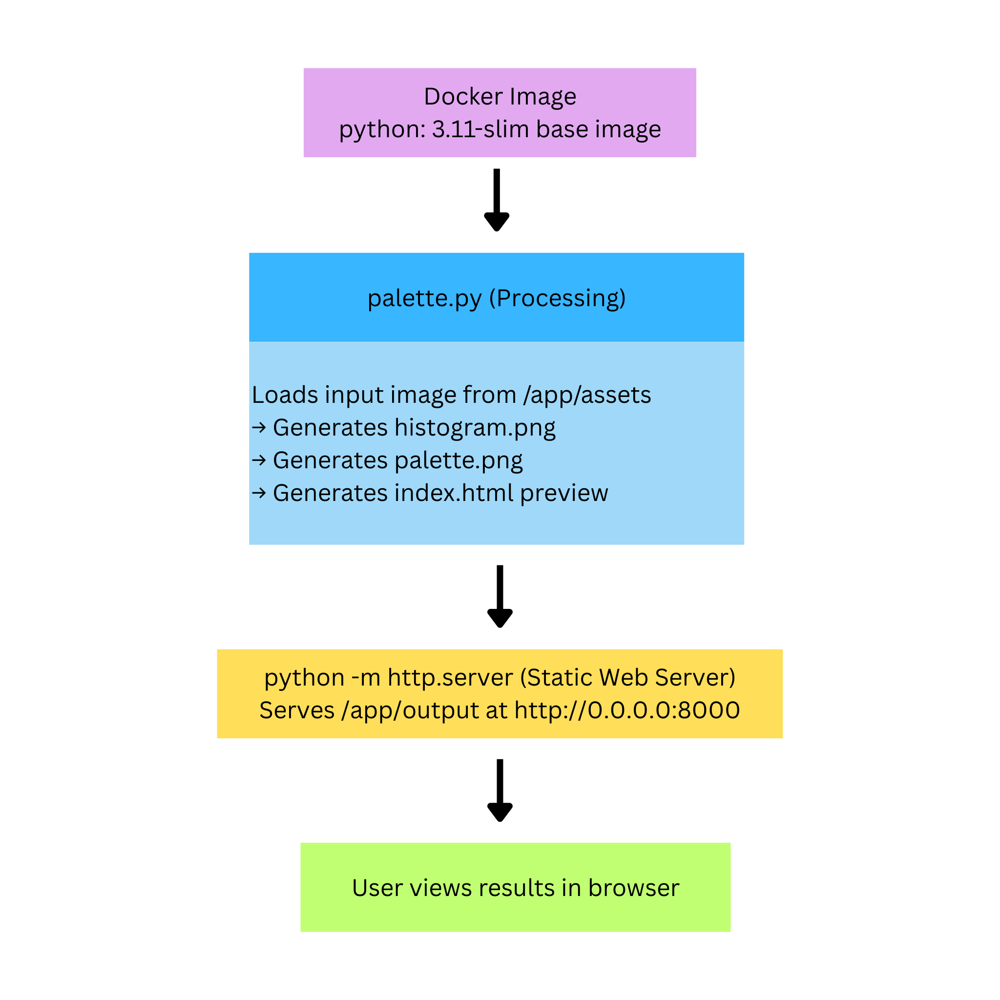
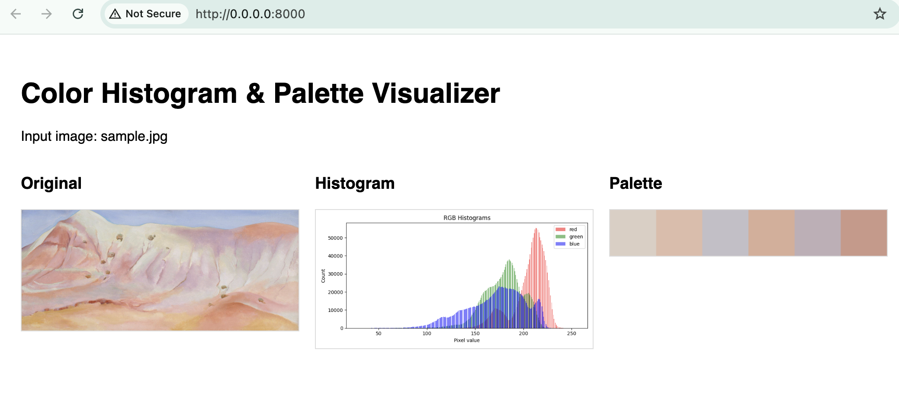

## 1) Executive summary

Designers and artists may want to analyze the major colors of a photo or art piece, in order to apply them to their own project or study color. Though, it may prove to be time-consuming on their own or require heavy software. Thus, this aims to make an artist’s process much more efficient, as they don’t have to train their eyes heavily to practice color theory. However, any students or developers may use this for a multitude of creative endeavors that involve collecting a color palette. 

The project provides a solution, a containerized tool that generates a color palette and RGB histograms from a given image. It’s simple and saves time for designers and artists as it runs reproducibly inside Docker and requires only one command to execute. It outputs a small HTML preview showing the original image, its histogram, and its color palette. 

## 2) System Overview 

Course Concept(s): Reproducible pipelines, Lightweight visualization pipeline (Pillow + Matplotlib)

Architecture Diagram: 



### Data / Model / Services

### Data: 
Sample Input Image: stored in assets/sample.jpg
Source: User-provided image
Format: JPEG (can also use PNG, WEBP, and GIF)
Size: 174,939 bytes
License: cite

### Models
 Color Quantization Algorithm: Pillow's built-in adaptive palette (Image.ADAPTIVE).
 Model file: None — the algorithm ships with the Pillow library.
 License: Pillow is licensed under the HPND license.

### Services
 palette.py: Core processing pipeline for histograms + palette
 Python http.server: Serves the generated output directory
 Docker Runtime: Ensures full reproducibility and portability

## 3) How to Run (Local)
Requires Docker installation.

```
# build
docker build -t paletteviz:latest .
# run
docker run --rm -p 8000:8000 \
  -v "$(pwd)/assets":/app/assets \
  -v "$(pwd)/output":/app/output \
  Paletteviz:latest
# health check 
test -f output/palette.png && echo "OK" || echo "FAILED"
```
## 5) Results & Evaluation
Sample output:


Performance notes:
- Runs in <1 second for small images
- Up to ~2–3 seconds for 4K images
-  RAM usage is minimal (<200 MB)

Validation/tests performed and outcomes:
- JPEGs, PNGs, grayscale images, and images 50px–4000px
- Various --colors values (3–12)

## 4) Design Decisions 
### Why this concept? 

I chose this to display a full, reproduciable data-processing pipeline in a simplistic way. I also liked that, as a creative person, it had a very visual output that could relate back to art. 

For alternatives, it k-means clustering may have been used for color extraction but that would have slowed larger images and efficiency was the aim. It could be a stretch goal instead.

### Tradeoffs

#### Performance
It runs fast for normal, small images but large ones take longer. Though, this is because Pillow and Matplotlib are lightweight and were used rather than using heavy machine-learning libraries. 

#### Cost
It has minimal cost, due to no stored data or paid APIs.

#### Complexity
It's very low in complexity, but this means that fewer thigns can break.

#### Maintainability 
Changing and updating the project is easy, as a result of a small codebase.

### Security/Privacy 
 No secrets required, validate that uploaded files are valid images, and images may contain PII but it processes locally and doesn't send to external services. 

### Ops  
#### Logs/metrics
The service logs basic activity automatically through FastAPI/Uvicorn (request path, status, timestamp). Application-level logs could be added to capture processing time, input size, and errors, but are not required

#### Scaling Considerations
Moving long-running jobs to a background queue and adding caching of results.

#### Known limitations
The generated palettes are very fast, k-means would be a more precise solution but heavier.
Additionally, output files with the same name may result in cached images.

## 6) What’s Next
- Add color percentage labels for each dominant color

    These additional insights could provide for more accurate color analysis. When designers and artists actually apply these colors, how much to weigh a color is a key component to the overall aesthetic. For example, an accent color will not have the same effect when it's used for a majority of the design. Thus, seeing how much these colors are used in the original piece will prove to be very useful.

- Add a FastAPI endpoint for uploads

    This would add a lot more to the convenience of the service. For the user, it will be much easier to upload images instead of adding them to the assets. 

## 7) Links
Github Repository: https://github.com/jet9kd/Final-Project
# FinalCase
